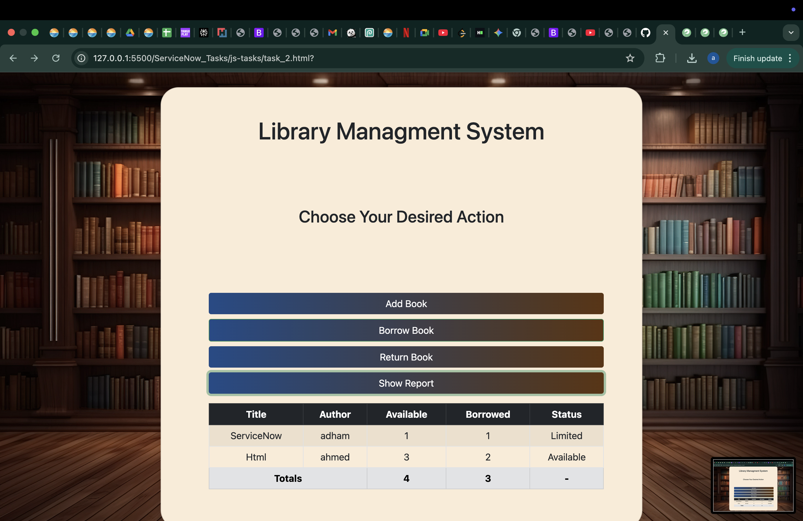

Task 1: Student Grades System

A console-based JavaScript program using prompt() and alert().

Features:
• Enter student name and age
• Enter at least 3 grades
• Calculate:
• Average grade
• Maximum grade
• Minimum grade
• Grade level (Excellent, Very Good, Good, Pass, Fail)
• Student status (Passed / Failed)
• Allow entering multiple students
• Display final report of all students

⸻⸻⸻⸻⸻⸻⸻⸻⸻⸻⸻⸻

Task 2: Library Management System

A simple system built using HTML, Bootstrap, and JavaScript.

Features:
• Add book
• Borrow book
• Return book
• Show report in a table

Books are stored in an array and managed using DOM manipulation.

**NOTE: AI was only used in the documentation and in the syntax of displaying the report as a table.**

## Screenshot

⸻⸻⸻⸻⸻⸻⸻⸻⸻⸻

Technologies Used
• HTML
• CSS
• Bootstrap 5
• JavaScript

⸻⸻⸻⸻⸻⸻⸻⸻⸻⸻⸻⸻

How to Run 
1. Open the HTML file in a browser. 
2. Follow the prompts to enter data. 
3. View results using alerts or tables.
